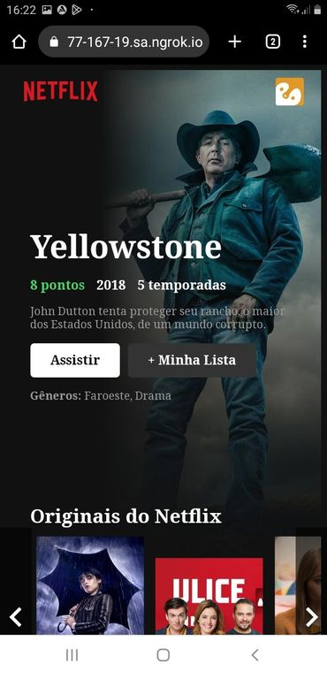

 # Projeto React

> Aperte em :star: se gostou do projeto. Pull Request são muito bem vistos

Eu sou o Guilherme e atualmente estou estudando a biblioteca React onde consegui produzir este projeto,
durante o desenvolvimento da aplicação utilizei diversos conceitos proprios do React como por exemplo:
  - JSX
  - useEffect
  - state
  - useState
  - E entre outros conceitos

Alem de tudo isso aprendi a comunicar diversos componentes passando suas informações por props. Se sinta livre em baixar o projeto e fazer alguma edição

Link do projeto no vercel: https://clone-netflix-flame.vercel.app/

    
    
    

